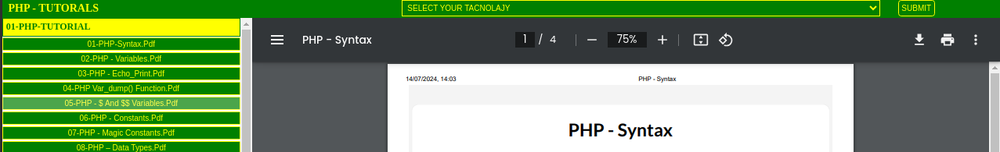

# PDF DOCX VIEWER

Pdf docx viewer is a web-based application for browsing and viewing documentation files (PDFs) stored in a structured directory. It allows users to select different technologies and navigate through their respective directories to view the documentation files.

## Table of Contents

1. [Features](#features)
2. [Installation](#installation)
3. [Usage](#usage)
4. [Screenshots](#screenshots)
5. [Directory Structure](#directory-structure)
6. [Contributing](#contributing)
7. [License](#license)
8. [Contact](#contact)

## Features

- **Browse Documentation**: View documentation files stored in a structured directory.
- **Technology Selection**: Select different technologies to browse their respective documentation.
- **Dynamic PDF Viewing**: View selected PDF files within an iframe.
- **Persistent State**: Remember the selected technology and last viewed PDF using cookies.

## Installation

### Prerequisites

- Web server with PHP support (e.g., Apache, Nginx)
- PHP 7.4 or higher
- Git

### Steps

1. **Clone the Repository**:
    ```bash
    git clone https://github.com/Ruhin1/pdf-docx-viewer.git
    cd pdf-docx-viewer
    ```

2. **Set Up Directory Permissions**:
    Ensure your web server has read access to the `documentation` directory.

3. **Start Your Web Server**:
    Ensure your web server is running and serving the project directory.

## Usage

1. **Open Your Browser**:
    Navigate to `http://127.0.0.1/path-to-your-project/` (replace `path-to-your-project` with the actual path).

2. **Select Technology**:
    Use the dropdown menu to select the desired technology.

3. **Browse and View PDFs**:
    Click on any documentation link to view the corresponding PDF in the iframe.

## Screenshots

### Home Page


### Technology Selection


### Documentation View


### Error Page


## Directory Structure

The directory structure should be as follows:

my-docx/
│
├── assets/
│ └── styles.css
│
├── documentation/
│ ├── php/
│ │ └── <PHP documentation files>
│ ├── python/
│ │ └── <Python documentation files>
│ └── <Other technologies>/
│ └── <Documentation files>
│
├── function.php
├── index.php
└── README.md

## Contributing

We welcome contributions from the community! Here’s how you can help:

1. Fork the repository.
2. Create a new branch (`git checkout -b feature-branch`).
3. Make your changes.
4. Commit your changes (`git commit -am 'Add new feature'`).
5. Push to the branch (`git push origin feature-branch`).
6. Open a Pull Request.

## License

This project is licensed under the MIT License. See the [LICENSE](LICENSE) file for details.

## Contact

Developed by [md tonmoy islam ruhin](https://ruhin1.github.io/tonmoy-islam.me/). You can reach me at [mdruhinahmed93@gmail.com](mailto:mdruhinahmed93@gmail.com).
